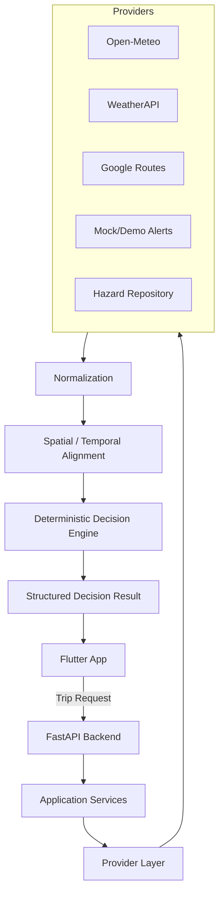

# WeatherGPT

**Conversational Weather Decision Intelligence for Context-Aware Travel**


---

## 1. Overview

**What is WeatherGPT?**

WeatherGPT is a conversational weather decision-intelligence system designed to help users safely navigate weather-sensitive activities.

User request → route → weather → hazards → alerts → deterministic decision engine → recommendation

Example user request:
*"Tomorrow at 8 AM I need to go from Noida Sector 62 to Gurgaon by bike. Should I go?"*

Instead of simply returning "Heavy Rain," WeatherGPT orchestrates route data, live weather forecasts, local hazards, and official alerts through a pure deterministic risk engine. It then returns a transparent, actionable decision grounded in data. WeatherGPT is **not** just a weather app, a weather chatbot, or a generic LLM wrapper.

---

## 2. Why WeatherGPT?

Traditional weather apps primarily provide:
- current weather
- forecast
- alerts

WeatherGPT adds contextual decision support using:
- route
- expected travel time
- transport mode
- route-level weather
- local hazard susceptibility
- alert context
- scenario comparison

We do not claim that WeatherGPT invented weather-aware routing. Its signature innovation is combining a pure deterministic decision engine with an LLM presentation layer to translate complex atmospheric and geographic variables into safe, context-aware travel actions.

---

## 3. Key Features

| Feature | Description | Status |
|---|---|---|
| Conversational trip planning | Text-based natural language requests | ✅ Implemented |
| Voice interaction | Animated mic UI for speech input | 🟡 UI Implemented, LLM pending |
| Route-aware weather | Weather mapped to exact geographic route segments | ✅ Implemented |
| What-If simulation | Slider to test alternate departure times | ✅ Implemented |
| Mode comparison | Evaluate risk across Bike, Car, Metro | ✅ Implemented |
| Risk assessment | Deterministic exposure and bottleneck calculation | ✅ Implemented |
| Local hazard intelligence | Curated historical hazard intersections | ✅ Implemented |
| Alert provenance | Strict fallback hierarchy and data tracking | ✅ Implemented |
| Source comparison | Handle primary, secondary, and mock overrides | ✅ Implemented |
| Historical replay | Rerun past disasters against the decision engine | 🔵 Planned |

---

## 4. Signature Technical Idea

The core WeatherGPT pipeline:

Route
+
Time
+
Weather
+
Transport exposure
+
Hazards
+
Alerts
↓
**Deterministic Decision Engine**
↓
Recommendation

WeatherGPT performs spatial-temporal reasoning by asking:
*"What weather will the user encounter at each relevant part of the route at the time they are expected to reach it?"*

---

## 5. Architecture



*(Note: Firestore persistence is a planned future layer for auditing decisions.)*

---

## 6. Deterministic Decision Engine

**The safety and risk decision is NOT made by the LLM.**

The engine handles:
- segment-level risk
- weather exposure
- route proximity
- temporal alignment
- transport exposure
- historical hazard relevance
- official/authoritative alert handling
- scenario evaluation
- confidence/data quality

**LLM:** Language understanding / explanation
**Decision Engine:** Risk and recommendation

This strict boundary prevents AI hallucinations regarding physical safety.

---

## 7. Data Providers

| Provider | Role | Status | Notes |
|---|---|---|---|
| Open-Meteo | Primary weather | ✅ Verified | Offline normalization active |
| WeatherAPI | Secondary weather/alerts | ✅ Verified | Never authoritative |
| Google Routes | Routing | ✅ Verified | Offline implementation complete |
| IMD | Authoritative alert source | ❌ Unavailable | Direct access blocked; Mocked |
| Hazard repository | Local hazard intelligence | ✅ Verified | Curated historical models |

---

## 8. Source Provenance and Safety Architecture

Data provenance is critical for transparent decision-making. WeatherGPT distinguishes between:
- authoritative
- secondary
- demo
- live
- mock
- unavailable

**Core Safety Rules:**
- Secondary providers cannot promote themselves to authoritative status.
- Demo alerts can only activate demo behavior under explicit demo configuration.
- Routing failures must not become fake “100 risk” decisions (Graceful degradation implemented).
- Unavailable data should result in an explicit degraded/unavailable state, adjusting the qualitative confidence score.

---

## 9. Local Hazard Intelligence

WeatherGPT uses a curated historical hotspot model for hyper-local hazards (e.g., known waterlogging areas).

*Historical hazard susceptibility ≠ currently observed hazard*

WeatherGPT determines current relevance using:
- route proximity
- expected passage time
- current/forecast weather trigger

Example:
**Historical waterlogging hotspot** + **heavy rainfall forecast** + **user passes through during rainfall** = **relevant hazard contribution**.

---

## 10. What-If Simulation

Users can evaluate alternate realities via stateless deterministic recalculations:
- earlier departure
- later departure
- different transport modes
- scenario changes

The Flutter frontend does not calculate production risk. The backend deterministic engine handles all scenario evaluations. A user can slide their departure time from 8:00 AM to 8:30 AM, instantly visualizing the risk score drop as they avoid a storm on the route map.

---

## 11. Tech Stack

| Layer | Technology |
|---|---|
| Mobile | Flutter / Dart |
| Backend | Python / FastAPI |
| Validation | Pydantic |
| State | Riverpod |
| Routing | Google Routes integration |
| Weather | Open-Meteo + WeatherAPI |
| Persistence | Firestore (Abstracted/Planned) |
| UI source | Google Stitch |
| Testing | Pytest + Flutter tests |

---

## 12. Project Structure

```text
weathergpt/
├── backend/               # FastAPI backend and pure decision engine
│   ├── app/               # Core application logic and API endpoints
│   └── tests/             # Exhaustive deterministic tests
├── docs/                  # Architecture and technical documentation
├── lib/                   # Flutter frontend code
│   ├── core/              # Services, theme, routing
│   ├── features/          # UI features (Home, Trip Analysis)
│   ├── models/            # Dart domain models
│   └── repositories/      # API clients and Mock fallback
├── test/                  # Flutter tests
├── WEATHERGPT_MASTER.md   # Original comprehensive project spec
└── README.md              # Project overview
```

---

## 13. Getting Started

### Prerequisites
- Flutter ^3.12.1
- Python >=3.11
- pip / virtualenv

### Backend Setup

```bash
cd backend
python3 -m venv venv
source venv/bin/activate
pip install -e ".[dev]"

# Run tests
pytest

# Run the FastAPI server
uvicorn app.main:app --reload
```

### Frontend Setup

```bash
# Return to the project root
cd ..
flutter pub get
flutter run
```
