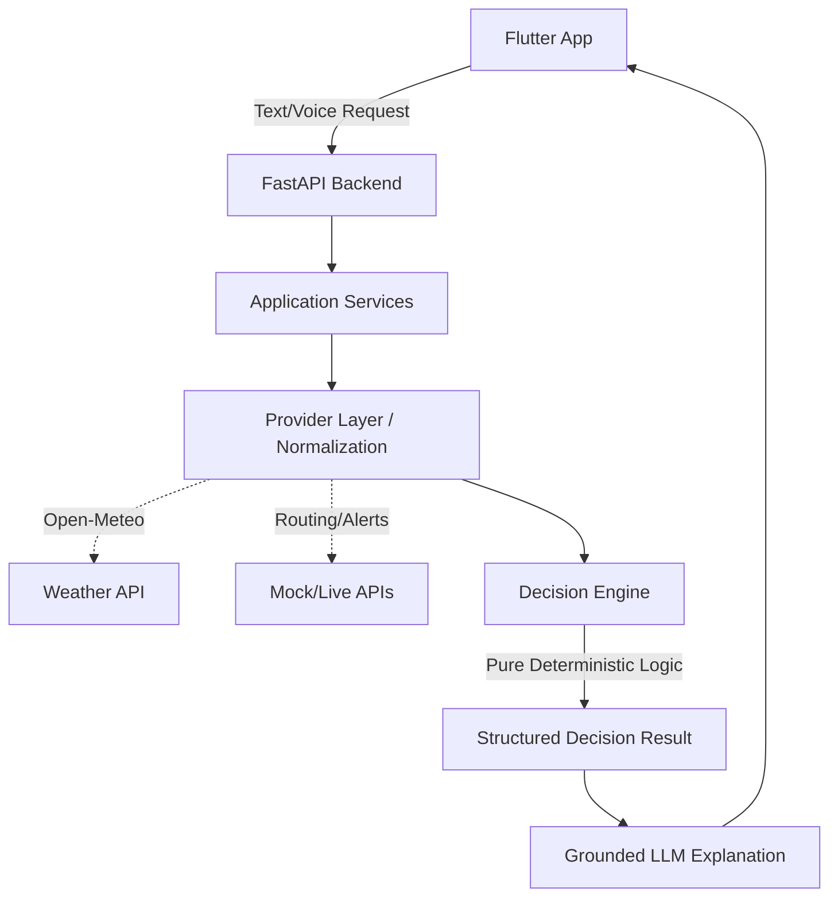

# WEATHERGPT
## Smart India Hackathon 2026 — Master Project Document

### 1. Document Control
- **Document Title**: WeatherGPT Master Project Document
- **Project Name**: WeatherGPT
- **SIH Problem Number**: SIH26068 (Conversational AI for Weather Forecasting, Alerts, and Climate Information)
- **Organization**: Ministry of Earth Sciences (MoES)
- **Theme**: Disaster Management
- **Current Version**: 1.0
- **Last Updated Date**: 2026-08-27
- **Status**: Active / In Development
- **Documentation Owner/Team**: WeatherGPT Engineering Team
- **Source-of-Truth Note**: This document serves as the authoritative high-level overview of the project. If implementation details drift, the active codebase (specifically `backend/app/decision_engine/` and `docs/`) holds the ultimate ground truth.

| Version | Date | Change | Author |
|---|---|---|---|
| 1.0 | 2026-08-27 | Initial master document creation | WeatherGPT Team |

---

### 2. Executive Summary

WeatherGPT is a conversational weather decision-intelligence system designed to help users safely navigate weather-sensitive activities. While traditional weather applications merely provide raw meteorological data (e.g., "It will rain at 8 AM"), WeatherGPT analyzes environmental data against the user's specific spatial route, temporal schedule, and transportation mode to provide actionable recommendations.

Through a voice-enabled interface, users can ask complex questions like, "Should I ride my bike from Noida to Gurgaon tomorrow at 8 AM?" The system orchestrates route data, live weather forecasts, local hazards, and official alerts through a pure deterministic risk engine. It then returns a transparent, actionable decision—such as recommending a departure delay or a switch to the Metro—grounded in data, rather than leaving the user to interpret raw weather variables.

---

### 3. SIH Problem Statement Alignment

- **Official Problem Statement**: SIH26068 — Conversational AI for Weather Forecasting, Alerts, and Climate Information
- **Organization**: Ministry of Earth Sciences (MoES)
- **Theme**: Disaster Management

**How WeatherGPT Aligns:**
The problem asks for an accessible conversational AI that provides weather forecasting and alerts. WeatherGPT fulfills this minimum requirement by implementing a natural language (voice/Hinglish) interface for weather data. 

**How WeatherGPT Goes Beyond:**
We identified that simply returning "Heavy Rain" via chat is no more useful than reading a traditional dashboard. WeatherGPT goes beyond the minimum requirement by introducing a **Decision Intelligence Engine**. It spatial-temporally aligns the forecast with the user's intended route and transportation mode, actively calculating exposure and risk, thereby transforming raw IMD/MoES data into direct disaster-avoidance actions.

---

### 4. Problem Definition

Today's users face fragmented environmental information. When planning a commute or outdoor trip during severe weather, a user must manually check a weather app, check a routing app for traffic, check news for waterlogging, and check official handles for government alerts. 

Even if a user gathers this data, there is a fundamental lack of contextual decision support. Weather changes geographically along a route, and different transport modes (e.g., a two-wheeler vs. the Metro) carry vastly different exposure risks. Users struggle to interpret warnings correctly and convert them into actionable changes to their departure time or travel mode.

---

### 5. Product Vision

“Convert authoritative environmental information into understandable, context-aware actions for weather-sensitive activities.”

Our vision is that no user should unknowingly drive into a severe storm or hazard simply because they couldn't synthesize route timelines and weather forecasts. The system acts as an intelligent safety layer, proactively translating complex atmospheric and geographic variables into simple, daily decisions.

---

### 6. Product Definition

**WeatherGPT is a deterministic, spatial-temporal decision engine wrapped in a conversational AI interface that recommends the safest travel modes and times based on hyper-local weather and hazards.**

- **What it does**: Parses natural language requests to evaluate travel risk, aligns weather forecasts across a route timeline, applies official alerts, and simulates "what-if" scenarios (e.g., leaving 30 minutes earlier).
- **What it does not do**: It does not predict the weather itself, it does not replace the IMD, and the LLM does not make safety decisions.
- **Primary Users**: Commuters, two-wheeler riders, and outdoor travelers facing severe weather.
- **Primary Use Cases**: Pre-trip planning, departure-time optimization, and transport-mode comparison during monsoon or extreme weather conditions.

---

### 7. Target Users

**Primary (Current Focus):**
- Daily commuters navigating severe weather (e.g., urban monsoons).
- Two-wheeler users (highly exposed to precipitation and visibility drops).
- Outdoor travelers navigating inter-city routes.
- People exposed to sudden severe weather changes.

**Future (Post-MVP):**
- Agricultural users requiring crop-specific weather decisions.
- Disaster-response coordinators requiring fleet routing through hazards.
- Logistics and supply chain operators.

---

### 8. Core User Journey

**User says:** “Kal 8 baje Noida se Gurgaon bike se jaana hai. Jaaun?” (Should I take my bike from Noida to Gurgaon tomorrow at 8 AM?)

1. **Intent Extraction**: The LLM parses the voice/text input.
2. **Context Creation**: Origin (Noida), Destination (Gurgaon), Time (8 AM), Mode (Bike).
3. **Data Fetching**: The backend fetches the Route, Weather Forecast, Traffic, Hazards, and Official Alerts.
4. **Spatial-Temporal Alignment**: Route segments are mapped to estimated arrival times and matched with localized weather buckets.
5. **Deterministic Risk Engine**: The engine calculates exposure risk and bottleneck risk based on the two-wheeler mode.
6. **Scenario Comparison**: The engine simulates alternate departure times (e.g., 7:30 AM, 8:30 AM).
7. **Recommendation**: The engine outputs a structured decision (e.g., "Delay to 8:30 AM to avoid heavy rain").
8. **Grounded Explanation**: The LLM generates a natural language explanation strictly adhering to the engine's output.
9. **Flutter Visualization**: The app displays the risk-colored route map, hazard markers, and conversational recommendation.

---

### 9. Core Features

| Feature | Description | User Value | Current Status |
|---|---|---|---|
| Conversational Text Input | Text-based natural language requests | Accessible interaction | ✅ Implemented |
| Voice / Hinglish Input | Speech-to-text with mixed language intent parsing | Hands-free, regional accessibility | ✅ Implemented (UI), 🟡 LLM Integration Mocked |
| Route-Aware Weather | Weather mapped to exact geographic route segments | Avoids single-point weather flaws | ✅ Implemented |
| Time-Aware Exposure | Weather matched to estimated time of arrival at segments | Accurate mid-trip forecasting | ✅ Implemented |
| Transport-Mode Risk | Exposure multipliers based on vehicle (Bike vs Car vs Metro) | Personalized safety assessment | ✅ Implemented |
| What-If Simulator | Slider to test different departure times | Empowers user flexibility | ✅ Implemented |
| Mode Comparison | Side-by-side risk comparison of transport modes | Enables safer choices | ✅ Implemented |
| Local Hazards | Static/dynamic hazard points intersecting the route | Hyper-local disaster avoidance | ✅ Implemented (Mock data) |
| Official Alerts | IMD/NDMA alert integration with exact geometry matching | Authority-driven overrides | ✅ Implemented (Mock data) |
| Risk & Confidence | Transparent scoring and qualitative data-quality confidence | Builds user trust | ✅ Implemented |
| Explanation / Provenance| Clear attribution of data sources and reasoning | Auditable AI | ✅ Implemented |
| Graceful Degradation | Fallback to secondary APIs or mock data upon failure | High system reliability | ✅ Implemented |

---

### 10. Signature Innovation

WeatherGPT does not claim to invent weather-aware routing. 

Its signature innovation is the **combination of a pure deterministic decision engine with an LLM presentation layer.** 
Unlike generic LLM chatbots that might hallucinate a safety recommendation by guessing based on text, WeatherGPT restricts the LLM to parsing intent and explaining outcomes. The actual safety assessment—combining spatial alignment, temporal alignment, transport-mode exposure, local hazard raycasting, and authoritative alerts—is calculated mathematically. This provides auditable, repeatable, and safe decision intelligence that a simple API wrapper or map application does not offer.

---

### 11. What WeatherGPT Is NOT

- **Not an autonomous weather forecasting model**: We rely on authoritative providers (e.g., IMD, Open-Meteo).
- **Not a replacement for IMD**: We amplify IMD warnings; we do not replace them.
- **Not a guaranteed safety system**: It provides risk assessment based on available data, not absolute guarantees.
- **Not a medical or emergency authority**: It cannot dictate disaster evacuation protocols.
- **Not a generic LLM wrapper**: Safety logic is entirely decoupled from generative AI.
- **Not claiming invention of weather routing**: We are innovating on the conversational decision-synthesis, not the fundamental GIS math.

---

### 12. System Architecture

**Conceptual Data Flow:**

**Key Boundaries:**
- The **Frontend (Flutter)** is strictly presentational.
- The **Decision Engine** has zero network I/O; it operates only on normalized Pydantic models in memory.
- The **Provider Layer** isolates external API quirks (e.g., WMO codes) from internal business logic.

---

### 13. Technology Stack

| Layer | Technology | Purpose | Status |
|---|---|---|---|
| Frontend | Flutter / Dart | Cross-platform mobile UI | ✅ Active |
| State Mgmt | Riverpod | Reactive state and dependency injection | ✅ Active |
| Routing (App) | go_router | Stateful bottom navigation | ✅ Active |
| Backend | Python FastAPI | High-performance async API | ✅ Active |
| Data Validation | Pydantic | Strict typing and normalized data contracts | ✅ Active |
| Weather Provider | Open-Meteo | Live hourly forecasts (CC-BY 4.0) | ✅ Active |
| Testing | pytest | Exhaustive deterministic engine tests | ✅ Active |
| Persistence | Firestore | Auditable decision logging | 🔵 Planned (Abstracted) |
| Maps | flutter_map | UI Map rendering | ✅ Active |

*(Note: Routing, Traffic, Alerts, and LLM providers currently use Mock implementations behind abstraction interfaces for MVP development).*

---

### 14. Deterministic Decision Engine

The Decision Engine evaluates Trip Contexts without making network calls.

**Core Modules:**
- **Route Sampling & Temporal Alignment**: Maps estimated arrival times to forecast buckets. *(MVP Simplification: Snaps to nearest hour).*
- **Hazard Proximity**: Checks if route segments intersect hazards. *(Engineering Assumption: Planar equirectangular approx + Haversine, 2.0km radius).*
- **Risk Scoring**: Evaluates bottleneck (max) risk and exposure (average) risk. *(Configurable Parameters: 60% Bottleneck, 40% Exposure weight).*
- **Mode Exposure**: Multiplies risk based on transport type. *(MVP Heuristics: Bike 1.0, Car 0.4, Metro 0.15).*
- **Precipitation Scoring**: *(Engineering Assumption: 3.0 * hourly mm accumulation).*
- **Alert Override**: Replaces risk calculation entirely if an official warning spatially and temporally overlaps the route.
- **Scenario Evaluation**: Deterministically searches alternate departure times (`-30m` to `+45m`) rejecting those that violate arrival deadlines.

---

### 15. Spatial-Temporal Reasoning

WeatherGPT does NOT only ask: “What is the weather at my destination?”

It asks: “What weather will the user encounter at segment N at time T?”
By aligning the polyline segments of a route with the estimated travel time, the engine samples the forecast timeline accurately. A 2-hour trip starting in clear weather might encounter a severe thunderstorm precisely at the halfway point. WeatherGPT visualizes and calculates this exact intersection, ensuring long routes are evaluated dynamically, not statically based on origin or destination alone.

---

### 16. Transportation Exposure Model

The engine acknowledges that 20mm of rain means something entirely different to a motorcycle rider than it does to someone in a car. 

**Current Modes (MVP Engineering Approximations):**
- **Two-Wheeler**: Highest exposure to rain, wind, and visibility drops.
- **Car**: Protected from rain, but susceptible to extreme waterlogging bottlenecks.
- **Metro**: Highly insulated from weather, generally the safest recommendation during urban monsoons.
- **Walking**: Highly exposed, slow travel time increases total exposure duration.

*Future Scope: Incorporating last-mile walking exposure for Metro users and granular transit disruptions.*

---

### 17. Official Alert Logic

The engine respects a strict authority hierarchy:
1. Official emergency/authoritative alert (e.g., IMD Red Alert)
2. Derived WeatherGPT calculation
3. LLM explanation

**Evaluation Logic:**
Alerts are parsed for their geometry (polygons). If a route raycasts through the polygon (Exact Match) and the travel time overlaps the alert's `issued_at` to `expires_at` window, the engine deterministically overrides the base risk score with the alert's severity. If polygons are missing, the engine falls back to a Regional Match. The LLM cannot override this rule.

---

### 18. Local Hazard Intelligence

WeatherGPT supports hyper-local hazards such as known waterlogging points, flooded underpasses, or severe road damage. 
If a hazard point falls within the configurable proximity radius (default 2.0km) of any route segment, that segment is flagged. 

*Current Status: The UI and engine fully support hazards using curated MVP demo data. Live dynamic ingestion is planned.*

---

### 19. Confidence and Uncertainty

WeatherGPT reports qualitative confidence: **High, Medium, or Low.**
It does not present fake statistical probabilities. Confidence drops if the forecast horizon is far in the future, if live providers fail and fallback to mock data, or if visibility/weather fields are missing. This ensures the user knows exactly how much to trust the recommendation.

---

### 20. What-If / Scenario Simulation

The system recalculates the exact same deterministic pipeline for alternate realities:
- Leaving 15/30/45 minutes earlier or later.
- Taking a Car instead of a Bike.

Because the engine is stateless and fast, it can evaluate dozens of scenarios instantly, feeding the UI a clear comparative matrix (e.g., "Leaving 30 minutes later reduces risk from High to Low").

---

### 21. Voice and Conversational Intelligence

**Flow:** Voice → STT → Intent Extraction (LLM) → Structured JSON Request → Decision Engine → Grounded Structured Result → LLM Explanation → TTS/UI.

The system is designed to handle Hinglish inputs. The generative AI is strictly constrained to the outer edges of the architecture (understanding the user, and speaking to the user). The mathematical core remains untouched by the LLM.

---

### 22. Data Sources and Providers

| Data | Provider | Purpose | Current Status | Fallback |
|---|---|---|---|---|
| Weather | Open-Meteo | Hourly local forecasts | ✅ Live | MockWeatherProvider |
| Routing | (Mocked) | Route segments & ETA | 🟡 Mocked | In-Memory Mock |
| Traffic | (Mocked) | Congestion modifiers | 🟡 Mocked | In-Memory Mock |
| Alerts | (Mocked) | IMD/NDMA Warnings | 🟡 Mocked | In-Memory Mock |
| Hazards | (Mocked) | Waterlogging points | 🟡 Mocked | In-Memory Mock |
| LLM | (Mocked) | Intent parsing & text | 🟡 Mocked | Rule-based Mock |

*Attribution: Open-Meteo data is provided via their non-commercial free-tier API under the CC BY 4.0 license.*

---

### 23. Failure Handling

Robustness is built into the provider layer. If Open-Meteo times out or returns a 5xx error, the system applies an exponential backoff retry. If it permanently fails, it gracefully degrades to a `MockWeatherProvider`. 
Crucially, the system preserves provenance: if it falls back to mock data, the UI explicitly states the data source has changed to prevent users from making safety decisions on stale or fabricated data. 
> The system fails honestly; it does not hallucinate missing information.

---

### 24. Security and Privacy

- **Secrets**: No API keys are hardcoded. Managed via `.env` and `pydantic-settings`.
- **Location**: Evaluated ephemerally for the trip context.
- **Architecture Limits**: The conversational LLM never receives raw user location histories, only the specific required bounding boxes or waypoints.

---

### 25. Firestore

**Role**: Abstracted persistence layer behind Repository interfaces.
**Purpose**: To store `TripResponse` audits, historical `analysis_id` logs, and dynamic hazards.
**Restriction**: Flutter does not access Firestore directly; all DB interactions are marshaled through the FastAPI backend to preserve security boundaries and business logic enforcement. *(Currently running on in-memory fallback for rapid development).*

---

### 26. Evaluation and Validation

**Implemented Evaluation:**
- **Deterministic Testing**: 15 exhaustive unit tests ensure the risk engine mathematically obeys geographic boundaries, severity guardrails, and departure constraints without flaking.

**Planned Evaluation:**
- **Historical Replay**: Re-running known past disasters (e.g., Delhi Monsoons 2023) through the engine to see if the recommendations would have successfully routed users away from flooded areas.
- **LLM Faithfulness**: Ensuring the LLM output strictly matches the engine's structured JSON without hallucinating safer conditions.

---

### 27. Competitive Positioning

While map services (like Google Maps) provide excellent routing, and weather apps (like AccuWeather) provide excellent forecasts, WeatherGPT bridges the gap. It provides explicit, mode-aware, conversational safety recommendations. 
We do not claim to have invented weather routing; our differentiation lies in our auditable, deterministic, India-focused decision layer, scenario reasoning, and conversational accessibility aimed squarely at disaster avoidance.

---

### 28. Scope Control

**In MVP (For SIH):**
- Flutter UI, FastAPI Backend, Pure Decision Engine.
- Live Weather Integration (Open-Meteo).
- Conversational intent matching & scenario simulation.
- Mode comparison and alert overrides.

**Future:**
- Live integration with IMD/NDMA APIs.
- Dynamic crowd-sourced hazard ingestion.
- True LLM intent parsing integration.

**Deliberately Excluded:**
- Autonomous weather forecasting models.
- Complex agentic loops that lack deterministic safety guarantees.
- User accounts and deep personalization (unnecessary for MVP safety decisions).

---

### 29. Current Implementation Status

| Component | Status | Evidence | Notes |
|---|---|---|---|
| Flutter UI | ✅ Complete | Repository | 21 screens built matching refined Stitch designs. |
| FastAPI Backend | ✅ Complete | `main.py`, models | Core orchestration running. |
| Decision Engine | ✅ Complete | `engine.py`, tests | 100% test pass rate on determinism. |
| Weather Provider| ✅ Live | `open_meteo.py` | Open-Meteo integrated with fallback & provenance. |
| Other Providers | 🟡 Mocked | `providers/*/mock.py` | Routing, Alerts, Traffic, LLM mocked for MVP. |
| Persistence | 🟡 Mocked | `repositories/` | In-memory fallback active; Firestore interfaces exist. |

---

### 30. Development Roadmap

1. **Phase 1-5 (Completed)**: UI Foundation & Mock Repositories.
2. **Phase 6-10 (Completed)**: Frontend Visuals & Interactive Simulators.
3. **Phase 11 (Completed)**: Backend Foundation, Decision Engine, Live Weather Provider.
4. **Phase 12 (Current)**: iOS Simulator Verification & Live LLM/Routing Integrations.
5. **SIH-Ready**: Final End-to-End Polish & Pitch Prep.

---

### 31. SIH Demo Strategy

The intended live demo flow:
1. **Input**: Natural Hinglish voice input ("Can I take my bike to work?").
2. **Visualization**: Flutter renders the route, segments colored by weather risk.
3. **Hazard Flagging**: A localized hazard intersects the route, raising the bottleneck score.
4. **The Signature "Flip"**: The user uses the What-If Simulator to delay departure by 45 minutes, or switches to the Metro. The engine recalculates instantly, the route turns green, and the recommendation flips to "Safe to travel."
5. **Transparency**: Clicking the confidence score reveals exactly why the decision was made.

---

### 32. Judge Questions & Defensible Answers

**Q: Isn't this just Gemini + a weather API?**
A: No. Gemini (or any LLM) never makes the safety decision. We built a pure, deterministic Python decision engine that spatial-temporally aligns route segments with forecast data. The LLM only parses the question and speaks the mathematical result.

**Q: How is your risk score calculated?**
A: It's an aggregation of the worst bottleneck segment (60% weight) and the overall time-weighted exposure (40%), multiplied by the vulnerability of the transport mode (e.g., bikes take 100% of the rain risk, cars take less). We have hard guardrails so a severe 5-minute hazard cannot be averaged away by a 2-hour sunny drive.

**Q: What happens when APIs fail?**
A: Our provider layer has explicit timeout and retry logic. If a live API fails permanently, the system degrades gracefully to mock data or cached state, explicitly notifying the user via the provenance tracker that the data source has changed. We prioritize honest failure over hallucination.

---

### 33. Known Limitations

- **Forecast Bucket Alignment**: The MVP snaps route arrival times to hourly forecast buckets; it does not probabilistically interpolate minute-by-minute weather micro-changes.
- **Provider Dependency**: The system's accuracy is fundamentally capped by the accuracy of the underlying API (e.g., Open-Meteo).
- **Engineering Heuristics**: Mode exposure multipliers are currently logical engineering estimates, not empirically derived statistics based on Indian mobility datasets.

---

### 34. Future Vision

Post-SIH, WeatherGPT can evolve into a generalized environmental decision platform. Beyond urban commuting, the architecture supports dropping in an "Agriculture Decision Profile" (replacing 'route exposure' with 'crop exposure') or a "Disaster Response Fleet Profile." By swapping the frontend and adjusting the exposure heuristics, the core spatial-temporal deterministic engine can support a vast array of climate-sensitive industries.

---

### 35. Final Project Summary

WeatherGPT transforms raw meteorological data into contextual safety intelligence. By mathematically aligning environmental conditions with a user's exact route, time, and vehicle—while strictly isolating this deterministic safety logic from generative AI hallucinations—the system provides a reliable, transparent, and actionable disaster-avoidance tool for everyday citizens. It does not just tell you that it will rain; it tells you exactly what to do about it.
