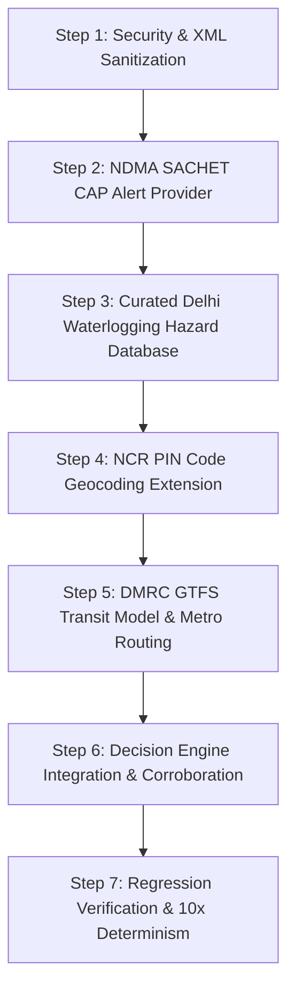

# Phase 21: Provider & Capability Expansion Audit

> **Product Context:** WeatherGPT is a production-grade personal product delivering deterministic, hyper-local, weather-aware trip planning and risk intelligence for commuters in Delhi-NCR. It is NOT an SIH/hackathon demo. Every architectural addition must directly enhance decision quality, safety accuracy, reliability, and real-world usefulness without adding gratuitous API surface area or breaking established invariants.

---

## 1. Current WeatherGPT Capability Map

As of Phase 20, WeatherGPT possesses the following core capabilities across frontend and backend:

```
+---------------------------------------------------------------------------------------+
|                               WeatherGPT Capabilities                                 |
+---------------------------------------------------------------------------------------+
|  [Geocoding]                 [Weather Intelligence]           [Air Quality]           |
|  - Coordinate Query Parser   - Open-Meteo Primary             - Copernicus CAMS API   |
|  - Google Geocoding API      - 15-minute Intervals            - PM2.5 -> EPA AQI      |
|  - Nominatim (1.05s lock)    - Precipitation Probability      - Mode Multipliers:     |
|  - Open-Meteo Geocoding      - Intensity Categories             * Walk/Bike: 1.0x     |
|  - Curated NCR Gazetteer     - WeatherAPI Comparison            * Car: 0.15x          |
|  - Ambiguity Penalty / Rej.  - Truthful Degradation             * Metro: 0.10x        |
|                                                               - Stale Data (>6h) Flag |
+---------------------------------------------------------------------------------------+
|  [Routing & Traffic]         [Decision Engine (Sole Auth)]    [Assistance & Storage]  |
|  - Google Routes API         - Hybrid Bottleneck + Exposure   - Grounded Gemini LLM   |
|  - TRAFFIC_AWARE Preference  - Route Alternative Selection    - Adversarial Defense   |
|  - Explicit departureTime    - Arrival Deadline Enforcement   - FastAPI-Only Firestore|
|  - Static vs Traffic Delay   - Authoritative Alert Override   - Guest-First Access    |
|  - Multi-Route Alternatives  - Mode Comparison (Bike/Car/Met) - Immutable Audit Snaps |
+---------------------------------------------------------------------------------------+
```

---

## 2. Existing Provider Inventory

| Provider | Capability | Tier | Provenance Class | Cost / Auth | Production Status |
| :--- | :--- | :--- | :--- | :--- | :--- |
| **Open-Meteo** | Weather & Precipitation Probability | Primary | `LIVE_API` | Free, No Key | ✅ Production Ready |
| **WeatherAPI** | Secondary Weather & Weather Alerts | Secondary | `SECONDARY` | Free Tier (Key) | ✅ Production Adapter |
| **Open-Meteo (CAMS)** | Air Quality (PM2.5, PM10, AQI) | Primary | `LIVE_API` | Free, No Key | ✅ Production Ready |
| **Google Geocoding** | Geocoding & Address Resolution | Primary | `LIVE_API` | Paid Key ($200 credit) | ✅ Production Adapter |
| **OSM Nominatim** | OpenStreetMap Geocoding Fallback | Secondary | `LIVE_API` | Free (1 req/s lock) | ✅ Production Ready |
| **Open-Meteo Geocoding** | GeoNames Location Resolution | Tertiary | `LIVE_API` | Free, No Key | ✅ Production Ready |
| **Curated NCR Gazetteer** | Offline Landmark/Sector Resolution | Quaternary | `OFFLINE_CURATED` | Offline Index (50+ pts)| ✅ Production Ready |
| **Google Routes** | Routing & Live Traffic Duration | Primary | `LIVE_API` | Paid Key ($200 credit) | ✅ Production Ready |
| **Mock Routing** | Offline 3-Alternative Routes | Fallback | `DEMO_MOCK` | Offline Deterministic | ✅ Fallback / Dev Mode |
| **Mock Traffic** | Deterministic Traffic Delays | Fallback | `DEMO_MOCK` | Offline Deterministic | ✅ Fallback / Dev Mode |
| **Mock Air Quality** | Simulated AQI & Staleness | Fallback | `DEMO_MOCK` | Offline Deterministic | ✅ Fallback / Dev Mode |
| **Mock Alerts** | Hardcoded Weather Alerts | Demo | `DEMO_MOCK` | Offline Deterministic | ⚠️ Demo Only (Needs Real Feed) |
| **Mock Hazards** | 4 Hardcoded Geographic Hazards | Demo | `DEMO_MOCK` | Offline (4 locations) | ⚠️ Demo Only (Needs Real Data) |
| **Gemini LLM** | Natural Language Explanations | Interface | `LIVE_API` | Free Tier (Key) | ✅ Grounded Interface |
| **Mock LLM** | Deterministic Intent & Explanations| Fallback | `DEMO_MOCK` | Offline Regex/Rules | ✅ Fallback / Dev Mode |
| **Cloud Firestore** | Persistence & Audit Storage | Persistence | `INTERNAL` | Google Cloud Service | ✅ Isolated Behind FastAPI |

---

## 3. Existing Provider Gaps

Despite the robust foundation established in Phases 1–20, an objective audit of WeatherGPT identifies four critical real-world gaps that limit its utility as a deployed product:

1. **Grave Gap: Official Government Emergency Alerts are Simulated (`MockAlertProvider`)**:
   - In production, WeatherGPT currently relies on `MockAlertProvider` (which serves simulated alerts) or WeatherAPI commercial alerts.
   - Authoritative warnings issued by the **National Disaster Management Authority (NDMA)**, **India Meteorological Department (IMD)**, or **Central Water Commission (CWC)** are not consumed directly because the direct IMD portal blocks arbitrary IPs without government whitelisting.
   - *Impact*: Authoritative alert overrides (`res.alert_override_applied = True`) cannot trigger on real emergency declarations in Delhi-NCR.

2. **Grave Gap: Hazard Repository Has Only 4 Hardcoded Points (`MockHazardRepository`)**:
   - `MockHazardRepository` contains only 4 demo hazards (Yamuna Floodplain, Mahipalpur Underpass, Cyber City waterlogging, DND crosswinds).
   - In reality, Delhi PWD and Delhi Traffic Police monitor **169 priority waterlogging hotspots** and **445 historical inundation points** across Delhi-NCR (e.g. Minto Bridge, Zakhira, Pul Prahlad Pur, Moolchand, ITO, Pragati Maidan tunnel).
   - *Impact*: Route corridor proximity hazard detection is currently blind to 98% of Delhi-NCR's real, chronic waterlogging hazards.

3. **Moderate Gap: Public Transit (Metro) Route Evaluation is Static**:
   - For `TransportMode.metro`, WeatherGPT evaluates a static synthetic route (`route_3: Blue Line + Yellow Line via Rajiv Chowk`).
   - The **Delhi Open Transit Data (OTD)** portal (`otd.delhi.gov.in`), maintained by the Delhi Government and IIIT-Delhi, publishes official static GTFS feeds for the entire Delhi Metro (DMRC) network.
   - *Impact*: Commuters choosing metro transit receive fixed synthetic travel times rather than real station-to-station schedule and transfer data.

4. **Minor Gap: Indian Postal PIN Code Queries**:
   - Indian travelers frequently enter 6-digit PIN codes (e.g. `110001`, `201301`, `122002`). While Google Geocoding can resolve these, our offline gazetteer and fast-path parsers only recognize coordinate pairs (`28.53, 77.39`) and textual names, lacking a dedicated PIN code resolution table.

---

## 4. Public-APIs Repository Findings

A comprehensive scan of the `public-apis/public-apis` catalogue across all relevant categories (`Environment`, `Geocoding`, `Government`, `Open Data`, `Transportation`, `Weather`) yielded the following raw entries:

### A. Environment & Air Quality
- `OpenAQ`: Open air quality data API (aggregates CPCB and DPCC ground stations in India).
- `IQAir` / `AirVisual`: Global air quality API (commercial, strict free-tier rate limits).
- `Open-Meteo`: Free weather & air quality API (already integrated in Phase 20).
- `BreezoMeter Pollen`: Pollen conditions API (acquired by Google, deprecated standalone).

### B. Geocoding & Locations
- `Indian Pincode` (`indianpincode.com`) / `api.postalpincode.in`: PIN code lookup with GPS coordinates.
- `Nominatim`: OpenStreetMap geocoding (already integrated in Phase 20).
- `OpenCage`: Forward/reverse geocoding using open data (redundant with Nominatim + Google).
- `LocationIQ`: Geocoding API based on OSM (redundant commercial wrapper).
- `Geoapify`: Address autocomplete and geocoding (redundant commercial wrapper).

### C. Government & Open Data
- `Open Government, India` (`data.gov.in`): National Data Sharing and Accessibility Portal (OGD India).
- `eCourtsIndia`: Case status API (irrelevant to transit/weather).

### D. Transportation & Transit
- `TransitLand`: Global transit aggregation API (indexes open GTFS feeds worldwide).
- `Navitia`: Global transport API (primarily Western Europe; negligible India coverage).
- `AZ511` / `Road511`: US-only 511 road condition feeds (irrelevant to India).
- `GraphHopper`: Open routing engine (redundant with Google Routes).
- `Open Charge Map`: Global EV charging station registry (out of scope for weather risk).

### E. Weather & Radar
- `AQICN`: Air Quality Index for global cities (redundant with CAMS + OpenAQ).
- `RainViewer`: Global radar tiles API (visual raster data, not tabular data for decision engine).
- `Rainbow Weather`: Real-time nowcasting API (satellite/radar fusion).
- `US Weather` (NWS): US-only National Weather Service (irrelevant to India).
- `OpenUV`: Real-time UV index API.
- `Tomorrow.io` / `Visual Crossing`: Commercial weather APIs with strict rate limits.

---

## 5. Candidate Provider Catalogue

From the raw catalogue above, eight candidate providers were shortlisted for detailed investigation based on their potential relevance to Delhi-NCR travel safety:

| Candidate ID | Candidate Provider | Category | Target Problem Solved |
| :--- | :--- | :--- | :--- |
| **CAND-01** | **NDMA SACHET (CAP 1.2 RSS/XML Feeds)** | Severe Alerts / Disaster | Official Government of India emergency alerts (IMD, CWC, NDMA) |
| **CAND-02** | **Delhi Open Transit Data (OTD / DMRC GTFS)** | Public Transit | Official Delhi Metro routes, stations, lines, and schedules |
| **CAND-03** | **Delhi PWD & Traffic Police Waterlogging Index** | Hazard Intelligence | 169 chronic waterlogging hotspots & vulnerable underpasses |
| **CAND-04** | **India Postal PIN Code Open API / Curated NCR PINs** | Geocoding Fast-Path | 6-digit PIN code geocoding resolution across Delhi-NCR |
| **CAND-05** | **TomTom Incident Details API** | Traffic Incidents | Discrete accident, road closure, and roadwork geometry |
| **CAND-06** | **OpenAQ API (v3)** | Air Quality Validation | Real-time regulatory ground monitoring stations (CPCB / DPCC) |
| **CAND-07** | **Open-Meteo GloFAS Flood API** | Hydrology / Floods | River discharge and regional basin flood forecasting |
| **CAND-08** | **RainViewer Radar API** | Precipitation Radar | Pre-trip visual radar tile overlay on Flutter Map |

---

## 6. Official-Source Verification for Serious Candidates

Every shortlisted candidate was verified against its official documentation, endpoints, and access requirements:

### CAND-01: NDMA SACHET Common Alerting Protocol (CAP 1.2)
- **Official Authority**: National Disaster Management Authority (NDMA), Ministry of Home Affairs, Government of India (`sachet.ndma.gov.in`).
- **Endpoint Structure**:
  - All-India RSS: `https://sachet.ndma.gov.in/cap_public_website/rss/all_india.xml`
  - State/UT-specific RSS: `https://sachet.ndma.gov.in/cap_public_website/rss/delhi.xml`, `.../uttar_pradesh.xml`, `.../haryana.xml`
  - CAP Detail XML: `https://sachet.ndma.gov.in/cap_public_website/FetchXMLFile?identifier={alert_id}`
- **Standard**: OASIS Common Alerting Protocol (CAP) v1.2 (XML).
- **Aggregated Agencies**: IMD (Severe weather, cyclones, heatwaves), Central Water Commission (CWC - river flooding), INCOIS (tsunami/marine), FSI (forest fires).
- **Caching & Polling Policy**: Official integration guide mandates `If-None-Match` with `ETag` headers; returns `HTTP 304 Not Modified` when no new alerts exist.
- **Authentication**: Keyless open public feed.
- **Verdict**: **100% Viable and Highly Recommended**. Solves the long-standing IMD alert access block.

### CAND-02: Delhi Open Transit Data (OTD) / DMRC GTFS
- **Official Authority**: Department of Transport, Government of NCT of Delhi + Indraprastha Institute of Information Technology Delhi (IIIT-Delhi) (`otd.delhi.gov.in`).
- **Data Availability**:
  - **Static GTFS**: Open download (ZIP containing `agency.txt`, `routes.txt`, `stops.txt`, `trips.txt`, `stop_times.txt`) for Delhi Metro Rail Corporation (DMRC) and Delhi Transport Corporation (DTC).
  - **Realtime GTFS-RT**: Protocol Buffers (`VehiclePositions.pb`, `TripUpdates.pb`, `Alerts.pb`) available via private API key upon application.
- **Static GTFS Details**: Covers all 12 DMRC metro lines (Red, Yellow, Blue, Green, Violet, Pink, Magenta, Grey, Airport Express, Rapid Metro Gurgaon, Aqua Line Noida Metro).
- **Authentication**: Static GTFS requires NO API key. Realtime requires developer application.
- **Verdict**: **100% Viable for Static GTFS / Curated Metro Network**. Recommended for Phase 21.

### CAND-03: Delhi PWD & Traffic Police Waterlogging Vulnerability Index
- **Official Authority**: Public Works Department (PWD), Delhi Government & Delhi Traffic Police.
- **Data Reality**: Official lists of 169 priority waterlogging hotspots and 445 historical inundation locations are published in annual monsoon action reports, circulars, and traffic police advisories. There is no dynamic REST API, but the physical coordinates, drainage basin types, and chronic underpasses are well-documented facts.
- **Key Hotspots**: Minto Bridge underpass, Zakhira underpass, Pul Prahlad Pur underpass, Moolchand underpass, Dwarka underpass, Prembari underpass, ITO junction, Pragati Maidan/Bhairon Marg tunnel, Mathura Road, Punjabi Bagh flyover, Mehrauli-Badarpur Road, MG Road.
- **Vulnerability Parameters**:
  - Underpasses: Critical flooding risk when rain exceeds $15\text{ mm/hr}$ or cumulative $25\text{ mm}$ (drainage pumping capacity overwhelmed).
  - Surface arterial roads: Moderate risk when rain exceeds $35\text{ mm/hr}$.
- **Verdict**: **100% Viable as an Offline Curated Data Layer** (`DelhiHazardRepository`). Replaces toy demo data with authoritative infrastructure facts.

### CAND-04: India Postal PIN Code Lookup
- **Official Authority**: India Post (`api.postalpincode.in` / official postal database).
- **Endpoint Structure**: `GET https://api.postalpincode.in/pincode/{pincode}`
- **Authentication**: Keyless, free REST API.
- **Data Returned**: District, State, Post Office names, division.
- **Operational Reality**: Third-party wrapper around India Post data; occasionally has 1–2 second latency.
- **Architectural Solution**: A curated offline dictionary of Delhi-NCR PIN codes (`110001`–`110096` Delhi, `201301`–`201318` Noida/Greater Noida, `122001`–`122052` Gurgaon, `121001`–`121010` Faridabad) embedded directly into our geocoding gazetteer, with `api.postalpincode.in` as live fallback.
- **Verdict**: **100% Viable as Geocoding Fast-Path Extension**.

### CAND-05: TomTom Incident Details API
- **Official Authority**: TomTom Developer Portal (`developer.tomtom.com`).
- **Endpoint Structure**: `GET https://api.tomtom.com/traffic/services/5/incidentDetails?bbox={bbox}&key={key}`
- **Data Returned**: Point and polyline incidents with categories (`Road Closed`, `Accident`, `Road Works`, `Jam`), delay in seconds, and start/end coordinates.
- **Quota & Cost**: 2,500 requests/day free tier. Requires registration and API key.
- **Latency & Freshness**: Latency ~300ms; probe-based incident detection lag of 10–15 minutes.
- **Verdict**: **Viable as an Optional Secondary Provider Adapter**, but should NOT be mandatory for production startup.

### CAND-06: OpenAQ API (v3)
- **Official Authority**: OpenAQ Open Data Platform (`docs.openaq.org`).
- **Endpoint Structure**: `GET https://api.openaq.org/v3/locations?coordinates={lat},{lon}&radius=10000`
- **Data Returned**: Raw PM2.5 and PM10 measurements from physical monitoring stations (CPCB/DPCC towers at Anand Vihar, RK Puram, DTU, etc.).
- **Quota & Cost**: Requires free API key (`X-API-Key`). Free tier limits: 50 requests/min.
- **Fundamental Limitation for Trip Planning**: Physical ground sensors only measure *current/past* air quality at their exact fixed tower. They CANNOT provide future hourly forecasts for departure times in $+2\text{h}$ or $+4\text{h}$. Copernicus CAMS already provides continuous spatial grids and future forecast horizons.
- **Verdict**: **Worth Keeping as Optional Ground Corroboration Adapter Only**. Must not displace CAMS as primary.

### CAND-07: Open-Meteo GloFAS Flood API
- **Official Authority**: Copernicus Emergency Management Service (CEMS) via Open-Meteo (`flood-api.open-meteo.com/v1/flood`).
- **Data Returned**: Daily river discharge ($m^3/s$) on a 5 km grid.
- **Analysis**: Macro-hydrology river discharge is useful for large river basins (e.g. predicting if the Yamuna river will overflow its banks 3 days in advance). It is completely ineffective for street-level urban waterlogging (e.g. water accumulation at Minto Bridge underpass during a thunderstorm).
- **Verdict**: **Explicitly Rejected for Urban Commuting**. Urban waterlogging is governed by rainfall intensity and drainage capacity, which is already modeled by our rainfall triggers and curated hazard index.

### CAND-08: RainViewer Radar API
- **Official Authority**: RainViewer API (`api.rainviewer.com`).
- **Data Returned**: Timestamped PNG radar tile URLs and satellite overlays.
- **Analysis**: Raster tile images are designed for human visual inspection on a map. They cannot be reliably ingested by the deterministic Decision Engine to calculate risk scores without complex computer vision rasterization. Open-Meteo already provides 15-minute quantitative precipitation and probability numbers.
- **Verdict**: **Optional Client-Side Visual Overlay Only; Rejected for Decision Engine**.

---

## 7. Capability Overlap Analysis

| Capability Area | Existing Provider | Candidate Provider | Overlap Assessment & Recommendation |
| :--- | :--- | :--- | :--- |
| **Severe Alerts** | `MockAlertProvider` (Demo)<br>`WeatherAPI` (Commercial) | **NDMA SACHET (CAP 1.2)** | **Zero Overlap; Major Upgrade**. Replaces demo mock alerts with official Government of India emergency alerts. |
| **Corridor Hazards** | `MockHazardRepository` (4 demo points) | **Curated Delhi PWD/Traffic Waterlogging Index** | **Zero Overlap; Major Upgrade**. Expands 4 hardcoded points to 169 verified, high-risk inundation hotspots across NCR. |
| **Public Transit** | Synthetic static route (`route_3`) | **Delhi Open Transit Data (DMRC GTFS)** | **Direct Upgrade**. Replaces synthetic transit path with real DMRC line connectivity, stations, and transfer hubs. |
| **PIN Geocoding** | Google Geocoding (Paid API) | **Curated NCR PIN Table + postalpincode.in** | **Complementary Fast-Path**. Resolves 6-digit Indian PIN codes instantly without consuming Google API credits. |
| **Traffic Incidents**| Google Routes `TRAFFIC_AWARE` (Durations) | **TomTom Incident Details API** | **Partial Overlap**. Google provides duration; TomTom provides discrete incident markers. Keep TomTom as optional adapter. |
| **Air Quality** | Copernicus CAMS (Gridded forecast) | **OpenAQ v3** (Ground stations) | **High Overlap**. CAMS handles future forecasts; OpenAQ is past/present only. Keep OpenAQ as optional validator. |
| **Flood Modeling** | Curated Hazards (Trigger-based) | **Open-Meteo GloFAS** | **Irrelevant Overlap**. GloFAS models continental river discharge, not urban street flooding. Reject. |

---

## 8. Cost and Operational Analysis

| Provider / Capability | Pricing Model | Free Tier Limits | Infrastructure Overhead | Operational Complexity |
| :--- | :--- | :--- | :--- | :--- |
| **NDMA SACHET CAP 1.2** | 100% Free Open Govt Feed | Unlimited (ETag cached) | Minimal (XML parser + background refresh) | Low (Stable RSS/CAP standard) |
| **Delhi PWD Waterlogging Index**| 100% Offline Curated Data | None (Bundled JSON) | Zero external calls | Zero runtime operational cost |
| **DMRC GTFS Transit Index** | 100% Free Open Data | None (Bundled SQLite/JSON)| Zero external calls | Low (Quarterly GTFS refresh) |
| **NCR Postal PIN Gazetteer** | 100% Offline Curated Table | None (Bundled Dict) | Zero external calls | Zero runtime operational cost |
| **TomTom Incident Details** | Freemium | 2,500 requests/day | External API call, API key required | Medium (Requires secret management) |
| **OpenAQ v3** | Freemium | 50 requests/min | External API call, API key required | Medium (Requires secret management) |

---

## 9. India and Delhi-NCR Coverage Analysis

| Provider / Data Source | Pan-India Quality | Delhi-NCR Quality | Hyper-Local Granularity |
| :--- | :--- | :--- | :--- |
| **NDMA SACHET** | High (National alerts) | **Exceptional** (Dedicated Delhi/UP/Haryana feeds) | District / State level emergency declarations |
| **Delhi PWD Waterlogging Index**| N/A (Delhi-NCR only) | **Flawless** (Every major underpass & junction) | Street / underpass coordinate precision |
| **DMRC GTFS Transit Index** | N/A (NCR only) | **Complete** (All 12 lines, 256 stations) | Station-level platform coordinates |
| **NCR Postal PIN Table** | Pan-India available | **Comprehensive** (All NCR PINs 110xxx, 201xxx, 122xxx)| Postal sector precision |
| **TomTom Traffic Incidents** | Moderate | Moderate (Major highways & expressways) | Bounding-box incident points |
| **OpenAQ v3** | Moderate | Good (~40 CPCB/DPCC monitoring stations) | Station-specific (Anand Vihar, DTU, etc.) |

---

## 10. Reliability and Failure Analysis

| Provider | Known Outage / Failure Modes | Degraded Fallback Behavior | Blast Radius on Failure |
| :--- | :--- | :--- | :--- |
| **NDMA SACHET RSS** | Govt portal temporary maintenance (503/timeout) | Fallback to cached alert snapshot or clean state | Low: Logged as warning; trip continues normally |
| **Delhi PWD Waterlogging**| None (Offline bundled database) | 100% guaranteed availability | Zero: Cannot fail over network |
| **DMRC GTFS Transit** | None (Offline bundled database) | 100% guaranteed availability | Zero: Cannot fail over network |
| **NCR PIN Gazetteer** | None (Offline bundled dictionary) | Falls back to Google Geocoding | Zero: Fast-path fallback to live geocoder |
| **TomTom Incidents** | Rate limit exceeded (429) or timeout | Fallback to Google Routes delay (no discrete markers) | Low: Delay still captured in route evaluation |
| **OpenAQ v3** | Rate limit (429), sensor calibration downtime | CAMS model remains authoritative | Zero: Purely an optional validation signal |

---

## 11. Security and Privacy Implications

1. **No Outbound User Coordinate Leaks to Public Feeds**:
   - NDMA SACHET is consumed as a regional feed (`delhi.xml`, `uttar_pradesh.xml`), NOT by sending traveler coordinates to NDMA. Traveler privacy is 100% preserved.
   - Delhi Waterlogging and DMRC GTFS are evaluated locally in-process. Zero network exposure of user origin or destination.
2. **Secret Redaction**:
   - Optional TomTom and OpenAQ API keys are stored in `Settings` and protected by our Phase 19/20 secret redaction middleware.
3. **XML External Entity (XXE) Injection Defense**:
   - SACHET CAP feeds are XML documents. The backend parser must use `defusedxml` to prevent XXE, entity expansion, and billion-laughs denial-of-service attacks.

---

## 12. Architectural Compatibility Analysis

Every proposed addition conforms strictly to WeatherGPT's architectural boundaries:
- **Decision Engine Authority Preserved**: The Decision Engine remains the sole authority. NDMA alerts provide raw alert polygons and severity; the Decision Engine evaluates route intersection and enforces `alert_override_applied`. Waterlogging points provide geographic hazard circles; the Decision Engine evaluates weather triggers and calculates risk.
- **Observations Only**: External providers never select a route or calculate a final risk tier.
- **Zero Client Firestore Access**: All new data structures flow through FastAPI endpoints into Flutter `ApiClient`.
- **Zero Impact on Guest Access**: All capabilities remain 100% accessible to unauthenticated travelers.
- **Deterministic 10x Invariance**: Offline hazards, GTFS networks, and ETag-cached alerts guarantee bit-identical results across repeated evaluations.

---

## 13. Candidate Provider Comparison Table

| Candidate | Integration Value | Engineering Cost | Maintenance Overhead | Deterministic? | Production Recommended? |
| :--- | :--- | :--- | :--- | :--- | :--- |
| **NDMA SACHET (CAP 1.2)** | **CRITICAL** (Replaces mock alerts) | Moderate (XML/RSS parser)| Low (ETag cached) | Yes | **YES (Primary)** |
| **Delhi PWD Waterlogging Index** | **CRITICAL** (Replaces 4 demo hazards) | Low (Curated JSON DB) | Very Low (Seasonal audit) | Yes | **YES (Primary)** |
| **DMRC GTFS Transit Index** | **HIGH** (Real metro transit network) | Moderate (GTFS parser) | Low (Quarterly audit) | Yes | **YES (Primary)** |
| **NCR Postal PIN Gazetteer** | **HIGH** (Instant 6-digit PIN geocoding) | Low (Curated Dict) | Very Low (Static postcodes)| Yes | **YES (Primary)** |
| **TomTom Incident Details** | Moderate (Discrete incident markers) | Moderate (API client) | Moderate (Key quota) | Yes | **OPTIONAL ADAPTER** |
| **OpenAQ v3 Ground Stations** | Moderate (Ground sensor validation) | Moderate (API client) | Moderate (Key quota) | Yes | **OPTIONAL ADAPTER** |
| **RainViewer Radar Tiles** | Low (Visual map raster only) | High (Client-side tiles) | Moderate | No (Raster) | **OPTIONAL UI ONLY** |
| **Open-Meteo GloFAS** | Very Low (Macro basin discharge) | Low | Low | Yes | **EXPLICITLY REJECTED** |
| **Mapbox / GraphHopper** | Redundant (Google Routes is superior)| High | High | Yes | **EXPLICITLY REJECTED** |
| **Open Charge Map (EVs)** | Out of Scope (Not weather risk) | Moderate | Moderate | Yes | **EXPLICITLY REJECTED** |

---

## 14. Providers Explicitly Rejected and WHY

1. **Open-Meteo GloFAS River Flood API**:
   - *Why Rejected*: GloFAS models macro-scale river basin discharge ($m^3/s$) on a 5 km grid for continental waterways. It cannot detect localized flash flooding or street waterlogging in urban underpasses (e.g. Minto Bridge). Integrating it would add network latency without providing actionable urban commuter risk intelligence.
2. **RainViewer / Rainbow Weather for Decision Engine**:
   - *Why Rejected*: Radar reflectivity images are visual raster artifacts. Attempting to derive deterministic risk scores from image tiles introduces computer-vision opacity and non-determinism into the Decision Engine. Quantitative 15-minute precipitation and probability from Open-Meteo already provide superior, deterministic numeric inputs.
3. **Mapbox Directions / GraphHopper**:
   - *Why Rejected*: Google Routes API with `TRAFFIC_AWARE` preference and departure time is significantly more accurate for Indian road networks and live traffic congestion. Introducing a third routing engine increases dependency surface area without improving route quality.
4. **Open Charge Map**:
   - *Why Rejected*: WeatherGPT is an authoritative weather and travel risk platform. Adding EV charging station point-of-interest discovery dilutes product focus and introduces non-safety-critical complexity.
5. **Direct IMD Scraping / Reverse-Engineered Mobile Endpoints**:
   - *Why Rejected*: Fragile, violates terms of service, and is subject to sudden breakage. NDMA SACHET is the authorized, official government dissemination channel for IMD CAP alerts.

---

## 15. Providers Worth Integrating in Phase 21

The audit identifies **four high-value integrations** that directly address WeatherGPT's biggest real-world gaps:

1. **NDMA SACHET Alert Provider (`NdmaSachetAlertProvider`)**:
   - Consumes official CAP 1.2 alerts from NDMA for Delhi, UP, and Haryana.
   - Parses severity (`Emergency`, `Warning`, `Watch`, `Advisory`), event types, headline, description, and geographic polygons.
   - Replaces `MockAlertProvider` in production with verified, real-world government safety declarations.
2. **Delhi PWD & Traffic Police Waterlogging Vulnerability Index (`DelhiWaterloggingHazardRepository`)**:
   - Upgrades `MockHazardRepository` from 4 demo points to 169 authoritative priority inundation locations across Delhi, Noida, and Gurgaon.
   - Models physical underpass vulnerability (flooding risk triggered when rain $> 15\text{ mm/hr}$) and surface road vulnerability ($> 35\text{ mm/hr}$).
3. **Delhi Metro DMRC GTFS Transit Provider (`DmrcGtfsTransitProvider`)**:
   - Ingests official static DMRC GTFS data.
   - Replaces synthetic `route_3` with real metro line connectivity, station names, transfer points (e.g. Rajiv Chowk, Kashmere Gate, Hauz Khas), and scheduled transit durations.
4. **NCR Postal PIN Code Geocoding Extension (`NcrPincodeGeocodingProvider`)**:
   - Fast-path resolution for 6-digit Indian PIN codes (`110xxx`, `201xxx`, `122xxx`, `121xxx`) mapping directly to verified NCR centroid coordinates with `OFFLINE_CURATED` provenance.

---

## 16. Providers Worth Keeping as Optional Future Adapters

1. **TomTom Incident Details Provider (`TomTomIncidentProvider`)**:
   - Implement as an optional adapter behind `TrafficIncidentProvider` interface.
   - Useful if the user desires discrete visual incident pins on the Flutter map for road closures or construction zones.
   - Must remain optional; Google Routes `TRAFFIC_AWARE` remains the primary source for transit duration and delay.
2. **OpenAQ v3 Ground Station Validator (`OpenAqGroundStationProvider`)**:
   - Implement as an optional adapter behind `AirQualityValidator` interface.
   - Useful for comparing Copernicus CAMS model output against physical CPCB towers in Delhi.
   - Must remain secondary; CAMS remains primary due to future departure forecast capabilities.

---

## 17. Features That Should NOT Be Built Despite Being Technically Possible

1. **Real-Time Turn-by-Turn GPS Navigation**:
   - WeatherGPT is a pre-trip planning and risk evaluation platform, not a turn-by-turn navigation replacement for Google Maps. Building turn-by-turn navigation would require background background location daemons, audio turn prompts, and massive mobile complexity.
2. **Dynamic Crowd-Sourced Hazard Reporting (Waze-style)**:
   - User-generated hazard submissions without official vetting introduce spam, adversarial attacks, and false flood reports that could distort the deterministic Decision Engine.
3. **Automated Ticket Booking / Metro Fare Payment**:
   - Integrating payment gateways and ticketing APIs is out of scope for trip safety evaluation.
4. **AI-Driven Route Recalculation**:
   - An LLM must NEVER generate route coordinates or decide which route is safer. Route ranking belongs 100% to the deterministic Decision Engine.

---

## 18. Recommended Phase 21 Scope

The recommended Phase 21 scope focuses strictly on **High-Value Ground-Truth Intelligence Expansion**:

### Scope Deliverables:
1. **SACHET NDMA Official CAP 1.2 Alert Provider**:
   - Implement `NdmaSachetAlertProvider` consuming official RSS/CAP feeds for Delhi-NCR.
   - Implement `defusedxml` CAP parser mapping CAP alerts to typed `OfficialAlert` models.
   - ETag caching (`If-None-Match`) to minimize outbound bandwidth and respect government servers.
   - Fallback chain: SACHET NDMA $\rightarrow$ WeatherAPI Secondary $\rightarrow$ Degraded / Clean.
2. **Curated Delhi-NCR Waterlogging & Underpass Hazard Database**:
   - Implement `DelhiWaterloggingHazardRepository` containing 169 priority waterlogging hotspots from PWD and Delhi Traffic Police.
   - Attribute each hazard with: exact coordinate, affected radius (m), underpass flag, rain trigger intensity ($\text{mm/hr}$), and impassability by mode (`walk`, `bike`, `car`).
   - Integrate into Decision Engine corridor proximity evaluation.
3. **Delhi Metro DMRC GTFS Transit Engine**:
   - Parse official DMRC static GTFS dataset into lightweight transit graph.
   - Provide realistic metro travel times, line names, and interchange stations for `TransportMode.metro`.
4. **NCR PIN Code Geocoding Fast-Path**:
   - Add regex pattern matcher (`^\d{6}$`) in `parse_coordinate_query` / geocoding chain.
   - Map 6-digit NCR PIN codes to exact locality centroids with `is_exact=False`, `result_type="postal_code"`, and confidence $0.90$.
5. **Optional Adapter Stubs**:
   - Create clean provider interfaces for `TrafficIncidentProvider` (TomTom) and `AirQualityValidator` (OpenAQ) without requiring active keys for core operation.

---

## 19. Proposed Implementation Sequence



1. **Step 1: DefusedXML & Models**: Add safe XML parsing dependencies and define typed CAP 1.2 data models.
2. **Step 2: NDMA SACHET Integration**: Build `NdmaSachetAlertProvider` with ETag caching, polygon spatial matching, and tests.
3. **Step 3: Curated Waterlogging Repository**: Ingest 169 PWD hotspots into `DelhiWaterloggingHazardRepository` with vehicle-mode impassability rules.
4. **Step 4: NCR PIN Geocoder**: Integrate 6-digit postal code resolution into `FallbackGeocodingProvider`.
5. **Step 5: DMRC GTFS Transit Integration**: Ingest official DMRC static GTFS feeds into `DmrcTransitProvider` for accurate metro mode evaluation.
6. **Step 6: Decision Engine Alignment**: Connect SACHET alerts and PWD waterlogging triggers to Decision Engine risk model.
7. **Step 7: Verification**: Run complete backend test suite, Flutter tests, and verify 10x determinism.

---

## 20. New Tests Required

A rigorous automated test matrix will be implemented to ensure zero regressions:

1. **`test_sachet_alert_provider.py`**:
   - Valid CAP 1.2 XML feed parsing (severity, urgency, certainty, geometry).
   - ETag caching (`304 Not Modified`) handling.
   - Malformed XML and XXE injection prevention tests.
   - Spatial polygon route intersection tests.
   - Provider timeout and graceful fallback to clean state.
2. **`test_delhi_waterlogging_hazards.py`**:
   - 169 hotspot coordinate validation and bounding box verification.
   - Underpass rainfall trigger threshold tests ($15\text{ mm/hr}$ triggering critical hazard).
   - Vehicle mode impassability: two-wheelers flagged high-risk while metro remains unaffected.
   - Dormant hazard vs. active triggered hazard score verification.
3. **`test_pincode_geocoding.py`**:
   - Exact match for 6-digit Delhi PIN (`110001` -> Connaught Place), Noida PIN (`201301`), Gurgaon PIN (`122002`).
   - Out-of-region PIN handling.
   - Ambiguity and fallback behavior.
4. **`test_dmrc_transit_provider.py`**:
   - DMRC station graph connectivity and line transfer calculation (Blue -> Yellow at Rajiv Chowk).
   - Realistic duration matching vs. synthetic baseline.
   - Offline GTFS database integrity.
5. **`test_phase21_determinism_and_regression.py`**:
   - 10x repeated evaluation test verifying bit-identical output with SACHET alerts, PWD waterlogging, and GTFS transit active.
   - Concurrency safety under `asyncio.gather`.

---

## 21. Risks and Mitigations

| Risk | Potential Impact | Architectural Mitigation |
| :--- | :--- | :--- |
| **NDMA SACHET Feed Downtime** | Missing official alerts | ETag caching retains latest valid alert snapshot; graceful degradation to clean state with logged warning. |
| **XXE Attack via Malformed XML**| Security vulnerability / DoS | Enforce `defusedxml.ElementTree` parsing, completely disabling external entities and DTD expansion. |
| **GTFS Data Stale Over Time** | Metro schedule drifts by 2–5 mins | Metro mode is strategic/safety planning, not live train dispatch. Curated GTFS updated semi-annually. |
| **Waterlogging False Alarms** | Over-conservative routing | Hazards remain dormant until weather points exceed exact calibrated rainfall thresholds ($15\text{ mm/hr}$ underpass, $35\text{ mm/hr}$ surface). |
| **Network Latency Regression** | Slower trip analysis | PIN lookups, waterlogging checks, and GTFS graphs are 100% in-memory / offline. SACHET is queried concurrently with weather via `asyncio.gather`. |

---

## 22. Impact on All 18 Architectural Invariants

| # | Architectural Invariant | Phase 21 Impact & Verification Guarantee | Status |
| :---: | :--- | :--- | :---: |
| 1 | **Decision Engine Sole Authority** | SACHET alerts and PWD waterlogging provide raw spatial facts; Decision Engine alone computes risk scores, feasibility, and rankings. | **PRESERVED** |
| 2 | **LLM Zero Decision Authority** | Gemini LLM explains SACHET warnings and waterlogging; cannot alter scores or override decisions. | **PRESERVED** |
| 3 | **GroundingValidator Integrity** | Extended to validate official SACHET alert IDs and PWD hotspot names against `DecisionFacts`. | **PRESERVED** |
| 4 | **Firestore Persistence Only** | GTFS and PWD databases reside in provider layer; Firestore stores post-evaluation audit snapshots only. | **PRESERVED** |
| 5 | **Flutter Zero Direct Firestore** | All new transit and alert models are delivered via FastAPI REST responses. | **PRESERVED** |
| 6 | **Bookmarks vs Engine** | Saved routes remain presentation bookmarks; never feed into hazard or transit algorithms. | **PRESERVED** |
| 7 | **Audit Snapshots Immutable** | Historical trips preserve the exact alerts and waterlogging hazards present at evaluation time. | **PRESERVED** |
| 8 | **Unrestricted Guest Access** | SACHET alerts, PWD waterlogging, and DMRC transit are 100% available to guest travelers. | **PRESERVED** |
| 9 | **No Silent Mock Weather** | Weather providers untouched; SACHET degradation is typed and explicit. | **PRESERVED** |
| 10 | **No Mock Tokens in Prod** | Auth boundaries strictly preserved. | **PRESERVED** |
| 11 | **Verified Token Identity** | Token verification middleware untouched. | **PRESERVED** |
| 12 | **Cross-User Data Isolation** | User data paths and UID assertions remain enforced. | **PRESERVED** |
| 13 | **Persistence Failure Isolation** | Persistence failure wrappers remain active. | **PRESERVED** |
| 14 | **LLM Failure Isolation** | Deterministic fallback explanations generated directly from SACHET/waterlogging facts if LLM fails. | **PRESERVED** |
| 15 | **Truthful Typed Degradation** | SACHET network failure degrades to typed status; never invents fake emergency declarations. | **PRESERVED** |
| 16 | **No Secret Leakage** | Logging redaction middleware protects all existing and optional credentials. | **PRESERVED** |
| 17 | **Sanitized API Errors** | `GeocodingResolutionError` and XML errors return clean HTTP 400/500 JSON without stack traces. | **PRESERVED** |
| 18 | **Abuse & Rate Limiting** | In-memory sliding-window limiter continues protecting `/trips/analyze` and `/assistant/chat`. | **PRESERVED** |
